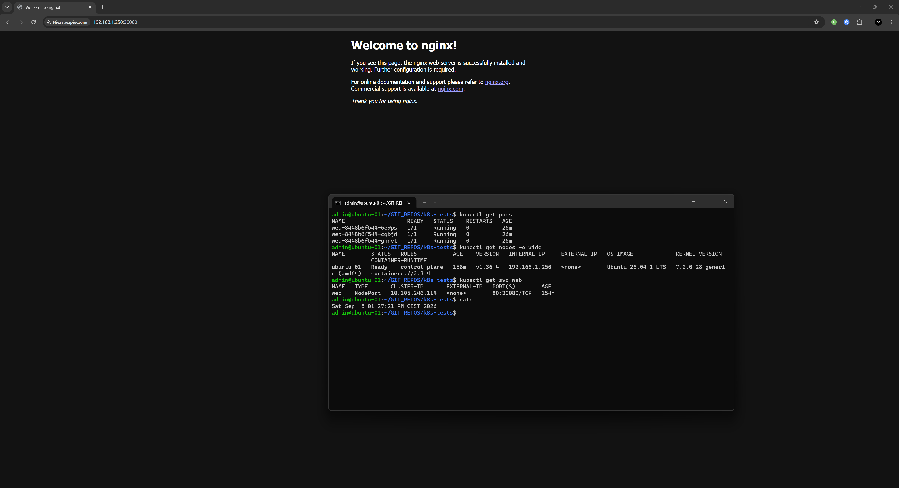

# k8s-tests

Personal Kubernetes practice repo  
  
    

## 2026-09-05 

#### Screenshots

#### Activity
- Created deployment and service for testing purposes and it worked somehow
- Fixed duplicate container caused by mixing `kubectl create` and `kubectl apply`
- Laerned: always use `apply`, never `create`, to keep the manifest as source of truth